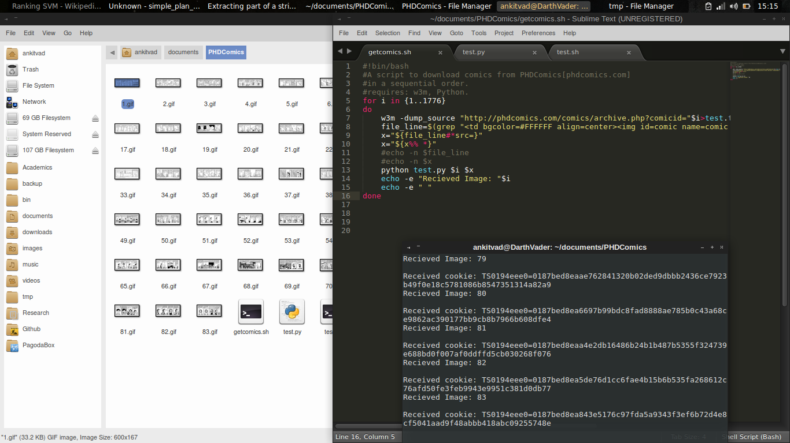

# GetComics
Uses Shell+w3m tool to sequentially dump HTML code to a file and then extract the desired URL of the image, sending it to a small Python script along with the current count so as to use Urllib+Python to
download the file, give it the desired count and then save it in the directory.
  
Could be used with BeautifulSoup+Python but i wanted to give shell a chance. As of 15th Jan 2015, PHDComics webhost has banned 'libcurl/curl' 'wget' 'lynx' and other tools to work on their server, i think. I wasn't able to get it running. 
Hence, <b>w3m</b> terminal browser was the only thing that didn't give a 403-error and hence could dump the soure in the desired text file. From there, it's just regular expression to parse the URL of the image.
 <b>Update:(15th Jan 2015)</b> 
Thanks to a fast script, 
<pre><code>
for i in {1..1776}
do
	if [[ ! -e "$i.gif" ]]; then
		echo -e $i".gif does not exist"
	fi
done
</code></pre> i just found out that there are some files which are missing, namely(.."just add the number after the =" "http://phdcomics.com/comics/archive.php?comicid= ") <b>
191, 194, 574, 657, 1433, 1575, 1582, 1594, 1599, 1605, 1616, 1628, 1639, 1643, 1657, 1663, 1669, 1680, 1683, 1685, 1691, 1694, 1707, 1714, 1716, 1718, 1726, 1748, 1766, 1769, 1770 </b> 
Out of these, 95% of the images have some embedded video to the image and/or only video. I don't like them as it is. The only good ones you should check out are: <b>574 and 1714</b> 
PS: This is just for educational purposes, as i wanted to pass all of the comics to my Kindle(..for offline viewing) this should not be used for bulk-downloading.
 
 License: Standard BSD License.
